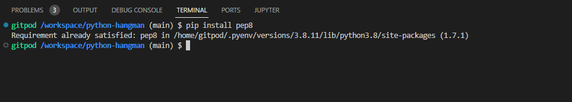

# Hangman
Hangman is a game where the player has to save the man from getting hanged. The player has to guess what word the computer has chosen for them either by guesseing one letter or the full word. The player has 7 tries to save the man. The game is made for people who just want a simple game to have fun. 

## Features

- Home page
- List of instructions

      
      

- Game screen
- Hangman image with body parts displayed depending on how many lives the player has
- Hyphens covering the word the player has to guess
- Number of lives remaining
- What letters have been used
- Input area for player to write letter or word they want to guess

## Features for the future
- Display high score

## Technologies
https://websitemockupgenerator.com/
https://heroku.com/apps
https://github.com/
https://www.gitpod.io/
### Languages
- Python

## Testing

This is what it looked like when I wanted to test my code.

I wanted to install the tool and this is what it looked like.

## bugs

## Deployment

## Credits

- word list
